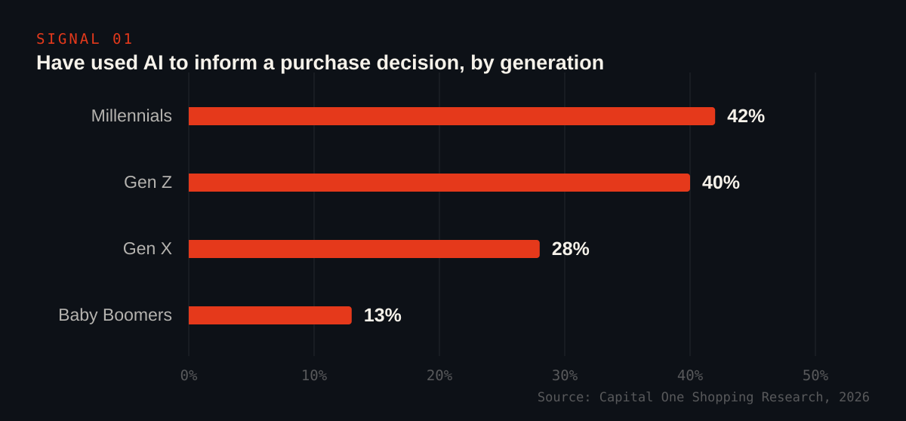
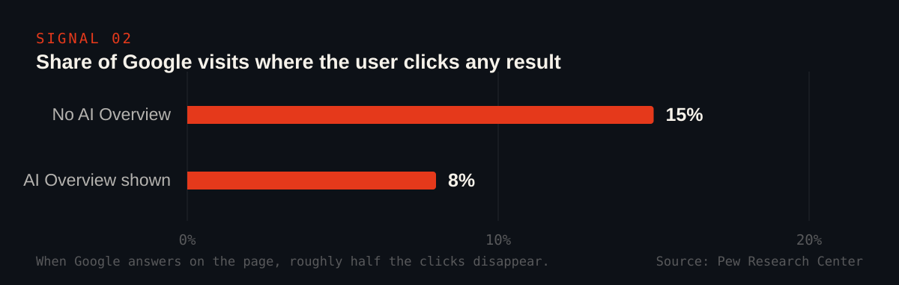

As of mid-2026, roughly 37% of consumers start their search with an AI tool
instead of Google, and 30% of U.S. consumers have used AI to inform a real
purchase decision. AI search is no longer a preview of how buying will work
someday. For a growing share of your customers, it is how buying works now.

The numbers below are from published 2026 research. Every one of them is
sourced, because that is exactly what AI engines reward and what we tell
clients to publish: verifiable claims, not vibes.

## The shift, in four stats

- AI-driven search grew from under 10% of search interactions in 2023 to
  about [30% in 2026](https://serps.io/blog/ai-search-statistics-2026).
- [37% of consumers](https://www.stackmatix.com/blog/ai-powered-search-engine-statistics)
  now start searches with AI tools instead of a search engine, and ChatGPT
  alone has passed
  [900 million weekly users](https://www.instantpress.co/ai-statistics),
  up from 400 million in early 2025.
- ChatGPT carries about
  [60.7% of all AI search traffic](https://sedestral.com/en/blog/ai-search-market-share-2026)
  as of February 2026.
- [58% of shoppers](https://www.bloomreach.com/en/news/2026/from-novelty-to-necessity-new-bloomreach-consumer-survey-finds-shoppers-now-prefer-ai-tools-to-shop/)
  say they use generative AI instead of traditional search to find
  recommendations.

None of this means Google is gone. About
[95% of Americans still use traditional search monthly](https://www.stackmatix.com/blog/ai-powered-search-engine-statistics).
Your buyers did not move. They added a second front door, and the second
door answers with three names instead of ten links.

## Who is actually deciding with AI

[Capital One Shopping's 2026 research](https://capitaloneshopping.com/research/ai-shopping-statistics/)
puts AI-informed purchasing at 30% of all U.S. consumers, and the
generational split shows where this is heading:

Millennials and Gen Z are your next decade of customers, and two in five of
them already let AI shape what they buy. The categories lead with
considered purchases:
[71% use AI for travel research, 65% for electronics, and 62% for financial products](https://www.yext.com/blog/7-data-backed-facts-on-ai-trust-and-consumer-decision-making-2026).
Exactly the kind of decisions where being one of the names the AI mentions
is worth real money.

One more finding that should shape your strategy, from
[Gartner's May 2026 consumer survey](https://www.gartner.com/en/newsroom/press-releases/2026-05-27-gartner-survey-finds-consumers-want-ai-shopping-help-but-not-ai-purchase-decisions):
among consumers who used AI for product research in the past 90 days, 86%
verified the AI's recommendation somewhere else before buying.

> The AI answer is not the end of the journey. It is the new shortlist.
> Buyers ask AI who to consider, then go confirm. If you are not in the
> answer, you are not in the running. If you are in the answer but your
> site, reviews, and profiles cannot survive the verification step, you
> lose the sale anyway.

## What happens to clicks when AI answers

The same shift shows up inside Google itself.
[Pew Research Center found](https://quickseo.ai/blog/google-ai-overviews-statistics-2026-60-data-points-every-seo-should-know)
that when an AI Overview appears, users click any result on only 8% of
visits, versus 15% when it does not:

[Ahrefs measured a 58% drop](https://www.medianama.com/2026/02/223-google-ai-overviews-click-through-rates-58-study/)
in click-through for the top organic result when an AI Overview is present.
The clicks that survive are not spread evenly:
[AI Overviews redistribute traffic toward the sites they cite](https://almcorp.com/blog/google-ai-overviews-organic-ctr-2026/)
and away from everyone else. And engagement with the AI answers themselves
is climbing:
[Seer Interactive measured CTR on AI Overviews nearly doubling](https://searchengineland.com/google-ai-overviews-ctr-recovery-study-475566)
between December 2025 and February 2026.

## The July 2026 scoreboard

| Signal | Number | Source |
| --- | --- | --- |
| Consumers starting searches with AI | 37% | Stackmatix, 2026 |
| U.S. consumers using AI to inform purchases | 30% | Capital One Shopping, 2026 |
| Millennials using AI for purchase decisions | 42% | Capital One Shopping, 2026 |
| Shoppers using GenAI instead of search for recommendations | 58% | Bloomreach, 2026 |
| AI researchers who verify before buying | 86% | Gartner, May 2026 |
| Click rate on Google visits with an AI Overview | 8% vs 15% | Pew Research Center |
| CTR drop for the #1 result under an AI Overview | 58% | Ahrefs, Dec 2025 |

## What this means if you run a business

Three practical conclusions fall out of the data:

1. **Being findable is no longer the same as being ranked.** An AI answer
   names a handful of businesses. Generative engine optimization is the
   work of becoming one of them, and it runs on different inputs than
   classic SEO: entity consistency, liftable answers, and the third-party
   sources each engine trusts.
2. **The verification layer decides the sale.** With 86% of AI-assisted
   buyers double-checking, your reviews, profiles, and site have to agree
   with what the AI said about you. Contradictions kill conversions.
3. **The window is a first-mover window.** Most local and mid-size
   competitors have not done this work. The seats in the answer are
   limited, and early entities tend to keep getting cited.

This is the exact problem [our GEO service](/ai-seo/) exists to solve: we
audit what the six major engines say when your buyers ask, engineer your
entity and sources, and track your share of the answer monthly. If you want
to know where you stand today, [book a free discovery call](/discovery/)
and we will show you the answers your customers are already seeing.
